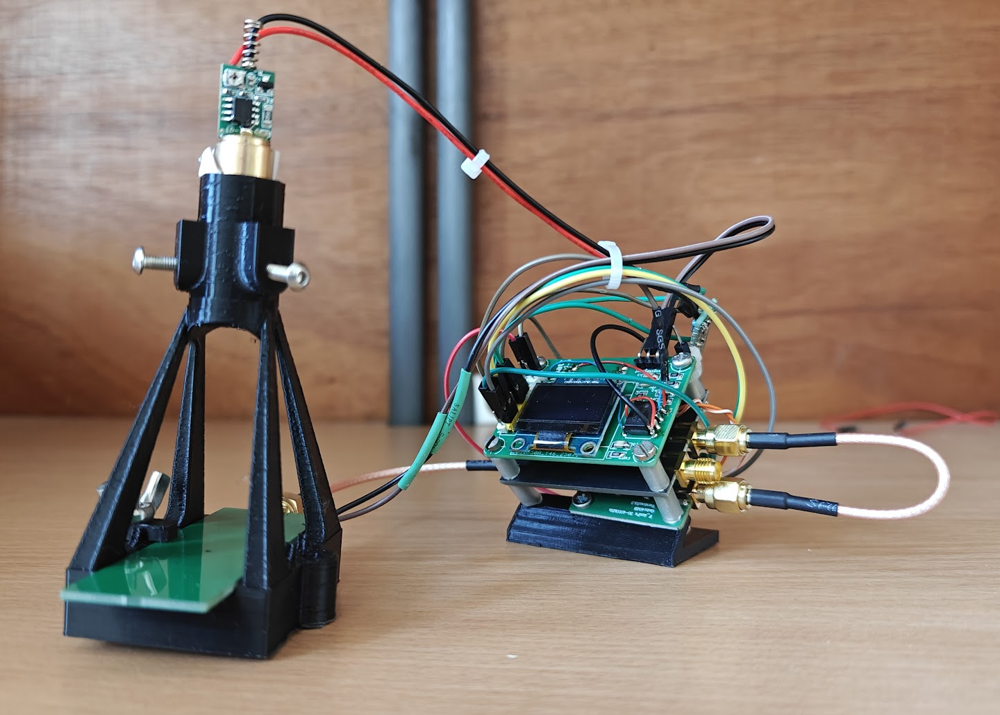
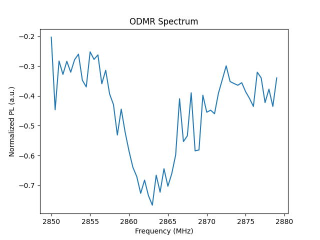

# Low-Cost Arduino-Based ODMR System for NV Centers in Diamond

[](LICENSE)
[](https://wiki.seeedstudio.com/XIAO_ESP32C3_Getting_Started/)

A fully open-source, low-cost Optically Detected Magnetic Resonance (ODMR)
spectrometer targeting nitrogen-vacancy (NV⁻) centers in diamond, built around
the **Seeeduino XIAO ESP32-C3** microcontroller and the **ADF4351** wideband
PLL synthesizer.

---

## Repository Structure

```
odmr_nv_repo/
├── hardware/
│   ├── schematic/          # KiCad schematic (.kicad_sch, .pdf)
│   ├── gerber/             # PCB Gerber files for fabrication
│   └── 3d_parts/           # STL files for 3-D printed optomechanics
├── software/
│   ├── firmware/           # Arduino (.ino) firmware for ESP32-C3
│   └── analysis/           # Python scripts for data processing & plotting
├── references/             # Key literature (DOI list + BibTeX)
├── results/
│   └── sample_data/        # Example sweep CSV outputs
├── BOM.csv                 # Bill of Materials with estimated costs
└── README.md
```

---

## Operating Principle

1. A **532 nm CW laser** (5 mW) illuminates
   the diamond sample, polarising NV spins into the ms = 0 ground state.
2. Microwave radiation from the **ADF4351** (2850 – 2890 MHz) is swept across
   the NV zero-field splitting (~2870 MHz).
3. At resonance, spin population is transferred to ms = ±1, reducing
   photoluminescence — the **ODMR dip**.
4. A silicon photodiode + **TL082 op-amp** transimpedance/buffer stage converts
   PL intensity to voltage; the ESP32-C3 ADC samples differentially (MW ON vs OFF)
   to extract contrast and reject common-mode noise.

---

## Quick Start

### Hardware
1. Fabricate the PCB from `hardware/gerber/` (e.g. JLCPCB / PCBWay, 2-layer).
2. Assemble components following `hardware/schematic/odmr_schematic.pdf` and `BOM.csv`.
3. Print `hardware/3d_parts/` STL files (PLA, 0.2 mm layer, 20% infill).
4. Mount: laser → ND filter holder → diamond stage → 550 nm longpass filter → photodiode.

## Experimental Setup



Figure: Compact, low-cost ODMR system integrating:
- ADF4351 microwave source
- ESP32-C3 control and acquisition board
- Fiber-coupled photodiode detection
- 3D-printed optomechanical mount

The system is designed for alignment simplicity and minimal footprint while maintaining sufficient stability for ODMR measurements.

### Firmware
1. Install **Arduino IDE ≥ 2.x** + ESP32 board support (`esp32` by Espressif, ≥ 3.x).
2. Open `software/firmware/odmr_firmware.ino`.
3. Select board: **XIAO_ESP32C3** — Flash 4 MB, no PSRAM.
4. Upload and open Serial Monitor at **115200 baud**.
5. Send:
   - `S` — full run (survey + differential sweep)
   - `V` — survey scan only
   - `D` — differential ODMR only
   - `X` — abort current scan

### Analysis
```bash
pip install numpy scipy matplotlib pandas
python software/analysis/odmr_analysis.py results/sample_data/sweep_example.csv```
---

## Example ODMR Spectrum



Figure: Optically Detected Magnetic Resonance (ODMR) spectrum of NV⁻ centers in diamond.

A clear fluorescence dip is observed near the zero-field splitting (~2870 MHz), corresponding to the ms = 0 → ms = ±1 transition. The contrast arises from spin-dependent intersystem crossing, which reduces photoluminescence at resonance.

Key observations:
- Broad dip centered around ~2862–2865 MHz (experimental offset likely due to calibration)
- Signal-to-noise sufficient for low-cost hardware
- Demonstrates feasibility of differential acquisition using MW ON/OFF modulation


## Sweep Parameters (default firmware)

| Parameter         | Value         | Notes                              |
|-------------------|---------------|------------------------------------|
| Frequency start   | 2850 MHz      | Below NV ZFS                       |
| Frequency stop    | 2890 MHz      | Above NV ZFS                       |
| Step size         | 0.5 MHz       | 500 kHz resolution                 |
| Averages / step   | 8 ON/OFF pairs| ~50 s total sweep                  |
| ADC integration   | 20 ms         | 50 Hz rejection (64-sample window) |
| RF settle time    | 5 ms          | Safe PLL lock margin               |

---

## License

MIT License — see [LICENSE](LICENSE).

## Citation

If you use this system in published work, please cite:

> Author(s). *Low-Cost Arduino ODMR for NV Centers in Diamond*. GitHub, 2026.
> https://github.com/YOUR_USERNAME/odmr_nv_repo
